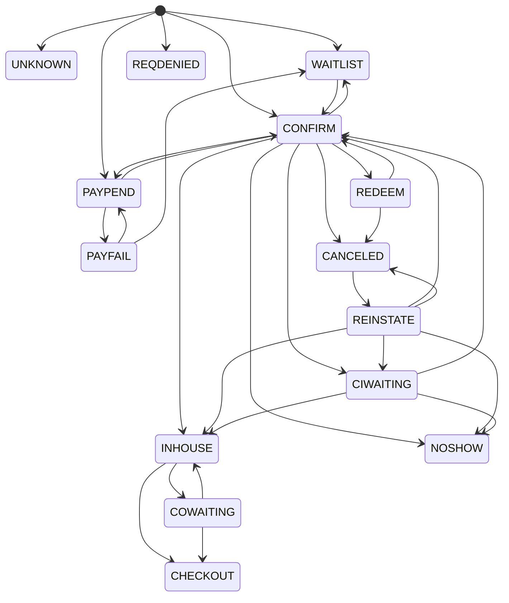

# Java Enum as State Machine

The following code repository demonstrates how a Java Enum implementation can be used 
to model a State Machine.

The demo code uses the Reservation Status enumeration to emulate how a Java Enum class can also be used to model the states at which Reservation Status can progress as a State Machine.

Given that the states of a reservation can be:-

- UNKNOWN
- REQDENIED
- WAITLIST
- PAYPEND
- PAYFAIL
- CONFIRM
- REDEEM
- CANCELED
- REINSTATE
- NOSHOW
- CIWAITING
- INHOUSE
- COWAITING
- CHECKOUT

The following figure illustrates the path at which the State of a Reservation Status can prograss.

